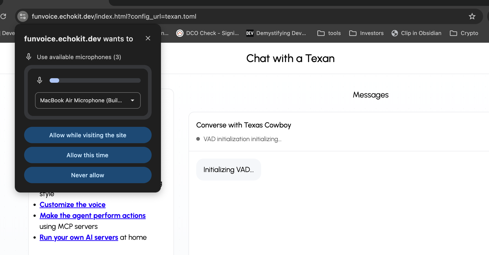

Have you ever wondered what your AI would sound like with a Southern drawl or a confident Texas accent?

Until now, these premium voices were paid add-ons — but **now you can try them for free** on the EchoKit web demo.

We’ve added diverse, natural accents including **Southern, Asian, African-American, New York, and Texas English**, bringing more authenticity and cultural depth to your conversations.  

Each voice is expressive and warm, built to sound like a real person rather than a robotic assistant.

<iframe width="560" height="315" src="https://youtube.com/shorts/JL-31jf0FqQ" title="EchoKit Voice Demo Video" frameborder="0" allow="accelerometer; autoplay; clipboard-write; encrypted-media; gyroscope; picture-in-picture" allowfullscreen ></iframe>

No installation or payment needed — just open the EchoKit web demo and start exploring: [https://funvoice.echokit.dev/](https://funvoice.echokit.dev/)

### How to Play 🎤

1. Open [https://funvoice.echokit.dev/](https://funvoice.echokit.dev/) in your browser.  
2. Choose the accent you want to try from **Cowboy, Diana, Asian, Pinup, or Stateman**.  
3. Allow the website to access your microphone when prompted.  

4. **Click on Start Listening**.  
5. Once you see **“WebSocket connected successfully”**, start talking to the character — it will respond in the selected voice!  
6. If you just want to listen, **click Stop Listening** to pause microphone input.

### How Did We Make It 🎛️

Want something truly personal?  

**EchoKit** is an open-source voice AI agent that lets you **customize every aspect** of both the hardware and software stack. One of the most popular features is **Voice Clone** — you can even clone your own voice!  

Ready to create a truly personal AI voice? Learn how to do it here: [Voice Cloning Guide](https://echokit.dev/docs/category/configuring-voice-for-echokit).

### From Browser to Device

Once you’ve experimented in the browser, you can take it even further.  
EchoKit lets you **play with these voices locally, on-device**, even using your **own voice**.  
Perfect for makers, educators, and AI hobbyists who want full control and real-time interaction.

🎧 Try the voices → [https://funvoice.echokit.dev/](https://funvoice.echokit.dev/)  
🛠️ Get your own EchoKit device → [https://echokit.dev/](https://echokit.dev/)

**EchoKit — the open-source Voice AI Agent that sounds just like you.**

Have any questions? Join our [Discord community](https://discord.gg/Fwe3zsT5g3)
