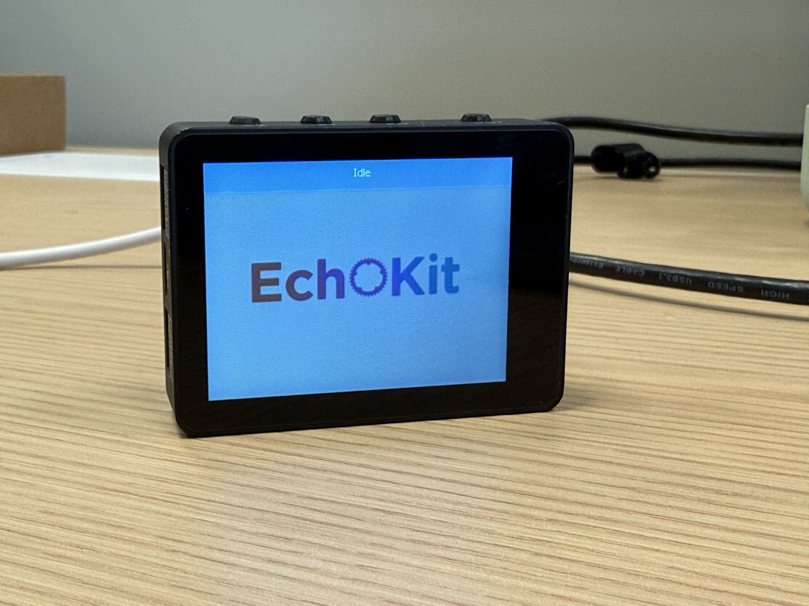
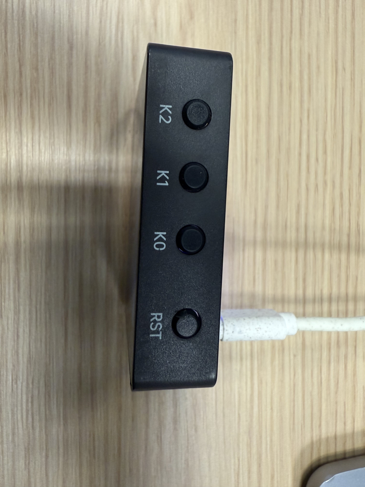
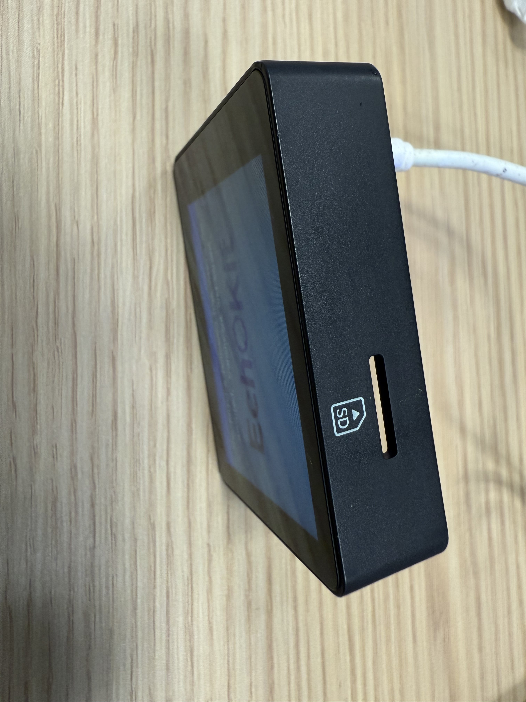
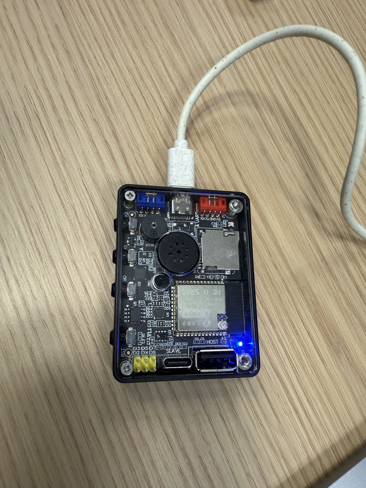

**A bigger screen. A cleaner design. A more powerful EchoKit.**

We’re excited to introduce [EchoKit Box](https://echokit.dev/echokit_box.html), the newest member of the EchoKit family — built for makers, educators, and anyone exploring voice AI Agent. 

EchoKit Box keeps everything people love about EchoKit, but elevates the hardware, polish, and usability in every way.

## Full-Front 2.4-inch OLED Display

One of the most visible upgrades in **EchoKit Box** is its **large full-front screen**.

The entire front of the device is a high-contrast **2.4-inch OLED display**, perfect for:

* System information
* Voice activity visualization
* Playing videos stored on the TF card
* Displaying graphics and custom UI
* MCP-driven animations

Unlike the previous EchoKit generation, the visual feedback is clearer and more interactive, making this device suitable for both teaching and advanced AI projects.

## Clearly Labeled Buttons (Including K0 and Reset)

Many users struggled to find the **K0 button** and **reset button** on the previous EchoKit DIY model. EchoKit Box solves this by placing **integrated, clearly labeled buttons** at the top of the device.

Clear hardware labeling = less confusion and faster development.

## TF Card Slot for Media and Local AI Workflows

At the bottom of the device, you’ll find a **TF card slot**.
You can store:

* Music
* Videos
* Offline content
* Custom datasets

And here’s where the fun begins:

> You can ask the large language model to generate **MCP actions** that play music or video stored on the TF card — directly on the device.

That means you can say:
**“Play the music on my memory card.”**
And the device will play it through the speaker.

## More Connectors for Additional Modules

On the side of the EchoKit Box, you’ll find **two colored connectors (blue and red)**.
These are expansion ports for sensors and modules, such as:

* Temperature sensors
* Cameras
* LED light modules
* GPIO-based sensors
* Custom peripherals

Using **MCP actions**, the large language model can control these modules:

* “Turn on the camera and take a picture.”
* “Read temperature from the blue port sensor.”
* “Switch on the LEDs.”

EchoKit Box becomes your **modular AI platform**, not just a single device.

## Transparent Back With Visible Electronics

The back of EchoKit Box features a **clear, transparent cover**, allowing you to see:

* The ESP32 CPU
* PCB and circuitry
* Speaker
* Microphone
* Components such as power regulators and drivers

Makers, students, and hardware enthusiasts love this design because it shows exactly how the AI device works internally.

This is especially useful for:

* STEM education
* AI education
* AI Hardware demos
* AI workshops
* DIY repair and customization
* Special gifts for developers

## Why We Love the New EchoKit Box

After months of iteration, we truly believe EchoKit Box is the most advanced EchoKit we’ve ever built:

* Bigger 2.4-inch display
* Better enclosure and build quality
* Clear hardware labeling
* TF card slot
* More connectors for sensors and modules
* Transparent back in geek style for education
* Dual USB ports for firmware flashing
* Great speaker/mic setup
* Fully open-source and ESP32 powered
* Works perfectly with local LLMs and MCP actions

It’s a **hackable voice AI device** that’s also **polished enough for demos, classrooms, hackathons, and real projects**.

## Final Thoughts

We’re really proud of the new **EchoKit Box**, and we think you’ll love building with it.

Whether you’re experimenting with **conversational AI**, creating an **embedded chatbot**, teaching students about **LLMs**, or building robotics projects with sensors, this device gives you everything you need.

Stay tuned — more updates, tutorials, and expansion modules are coming soon.
