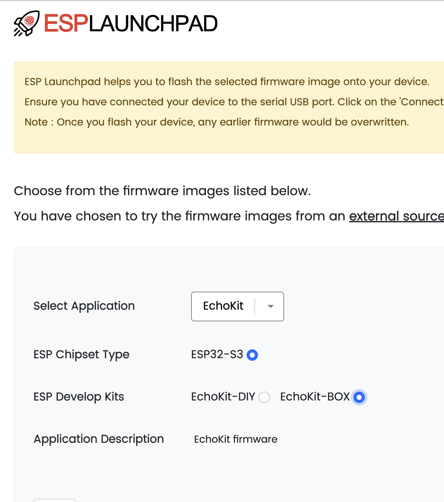
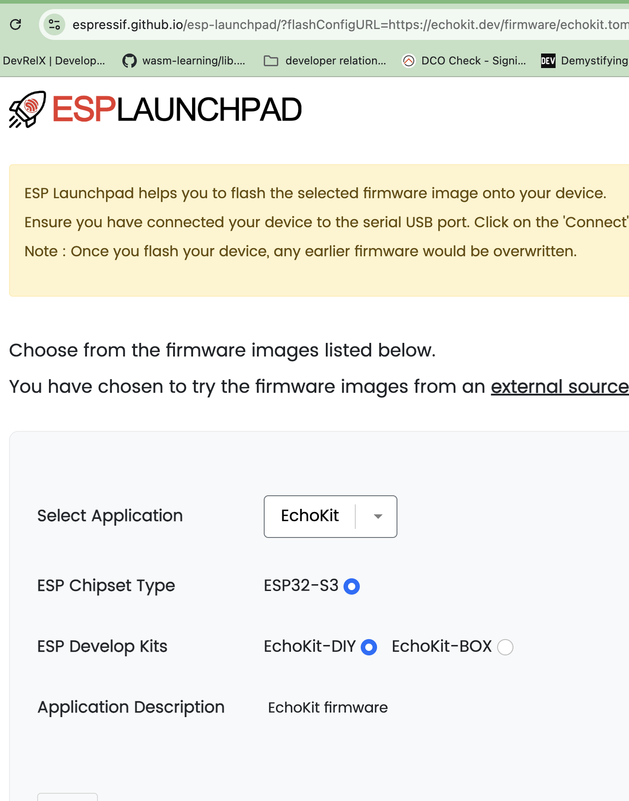

Over the last 20 days, we’ve been building EchoKit step by step — from voice pipelines and local models to MCP tools and personalities.

Today, I want to focus on something more foundational:

**firmware.**

In this post, we’ll walk through how to flash EchoKit firmware using the **ESP Launchpad web tool**. This approach is direct, dependency-free, and works entirely from the browser. 

> Want to learn to flash via the command line? We will talk about it tomorrow.

## EchoKit Firmware Is Open Source — and Always Moving

EchoKit’s firmware is fully open source. The code is public, changes are visible, and improvements land continuously. Bugs are fixed in the open, and new capabilities are added incrementally.

Because of this, the firmware repository doesn’t stand still. As EchoKit evolves, the firmware evolves with it — whether that’s protocol adjustments, performance improvements, new device capabilities, or better defaults.

This means EchoKit is not a “flash once and forget” system.

You should expect to refresh the firmware from time to time. More importantly, you should feel comfortable doing so.

---

## Flashing with ESP Launchpad

ESP Launchpad allows you to flash prebuilt EchoKit firmware directly from a browser, with no local toolchains or dependencies to install.

You can open the ESP Launchpad page here, which is preconfigured with EchoKit firmware profiles:

[https://espressif.github.io/esp-launchpad/?flashConfigURL=https://echokit.dev/firmware/echokit.toml](https://espressif.github.io/esp-launchpad/?flashConfigURL=https://echokit.dev/firmware/echokit.toml)

The flashing process is exactly the same for **EchoKit Box** and **EchoKit DIY**. The only difference is which firmware profile you select.

### EchoKit Box

To flash EchoKit Box, open the flashing page, connect the device to your computer via USB, select **EchoKit Box**, and click *Flash*.

The flashing process takes a few minutes. Once it completes successfully, the page will prompt you to reset the device. After rebooting, you’ll see the QR code screen, which indicates the firmware is ready. That’s it.

### EchoKit DIY

EchoKit DIY uses the exact same flashing flow.

The only difference is the firmware profile you choose. On the same flashing page, connect your DIY device via USB, select **EchoKit DIY**, and click Flash.

Everything else is identical: the flashing takes a few minutes, you reset the device when prompted, and the QR code appears after reboot.

Once flashing is complete, move on to the next step: connecting the EchoKit server and your device so EchoKit can talk to you.

## Why Firmware Refreshing Is Important

Many products try to hide firmware updates as much as possible.

EchoKit does the opposite.

EchoKit is an open system. You’re encouraged to explore it, modify it, and keep it up to date. Firmware updates are a normal part of the workflow, not an exception.

Using a browser-based flasher removes most of the friction. There are no toolchains to install, no OS-specific instructions, and no dependency management. This makes firmware updates accessible even to non-programmers.

