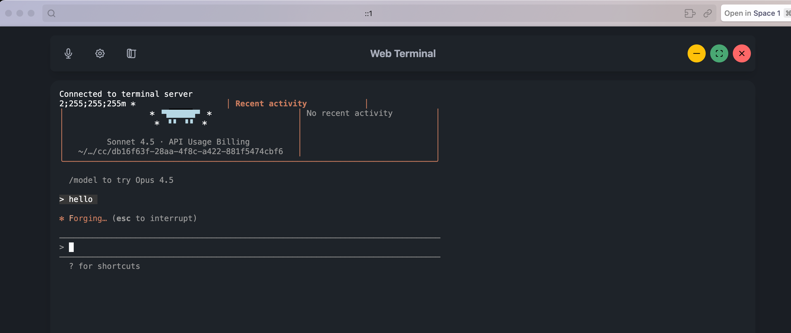

Claude Code is amazing. It writes code, fixes bugs, runs tests, explains errors. But it lives in your terminal. To use it, you type commands, get responses. It's a CLI tool, designed for terminal workflows.

But what if you want to build something on top of Claude Code? What if you want a web app? A mobile interface? A physical device? Voice control?

That's why we built **echokit_pty**.

## What Is echokit_pty?

**echokit_pty** is the web version of Claude Code with a superpower: a WebSocket interface.

It handles Claude Code's input and output, turning its CLI into a WebSocket service. Suddenly, Claude Code isn't just a terminal app—it's a service that *any application* can talk to.

**What makes it special?**
- Full Claude Code capabilities (file editing, command execution, tool use)
- **Clean JSON API for integrations**. Check out the full API documentation [here](https://github.com/second-state/echokit_pty?tab=readme-ov-file#api).
- **Open and extensible** - unlike Claude Code's official Remote Control, you have full control over the protocol and can customize every aspect
- **No subscription required** - free and open source vs. Max-only Remote Control
- Bidirectional streaming (real-time responses)
- Runs locally
- Built for developers building custom solutions

## The Problem: Claude Code Is Trapped in the Terminal

Claude Code was designed as a CLI tool. You run it in your terminal, type commands, get responses. This works great for terminal workflows.

But what if you want to:
- Build a web app that uses Claude Code?
- Create a physical device that talks to Claude Code?
- Integrate Claude Code into another tool?
- Build a custom application that needs programmatic access?

**Yes, Claude Code now has an official Remote Control feature** for mobile and web access. But it's designed as a user-facing feature, not a developer platform. It requires a Max subscription, uses a closed protocol, and can't be integrated into custom applications.

That's where echokit_pty comes in.

## The Solution: PTY + WebSocket

The bridge is **echokit_pty**.

**What does "pty" mean?**

PTY stands for "pseudo-terminal"—a Unix concept that allows a program to control a terminal as if a user were typing.

echokit_pty uses this technology to create a bridge between:
- **WebSocket clients** → send JSON commands
- **Claude Code CLI** → executes the commands
- **Response streaming** → sends results back

## How It Works

echokit_pty is built with Rust. Here's the architecture:

```
┌─────────────────┐     WebSocket      ┌──────────────┐
│   Any Client    │ ◄─────────────────► │ echokit_pty  │
│  (Web, Mobile,  │     (ws://localhost)│   (Rust)     │
│   Device, etc.) │                     └──────┬───────┘
└─────────────────┘                            │
                                               │ PTY
                                               ↓
                                        ┌──────────────┐
                                        │ Claude Code  │
                                        │    CLI       │
                                        └──────────────┘
```

**The flow:**
1. echokit_pty starts a WebSocket server (default: `ws://localhost:3000/ws`)
2. Clients connect via WebSocket and send JSON commands
3. echokit_pty forwards commands to Claude Code CLI through a pseudo-terminal
4. Claude Code executes the command
5. Results stream back through the WebSocket in real-time

**Example:**
```json
// Client sends
{"type": "command", "content": "run the tests"}

// echokit_pty forwards to Claude Code

// Results stream back
{"type": "response", "content": "Running tests...\n142 passed, 3 failed"}
```

## Getting Started

**Installation:**

First, clone and build echokit_pty:

```bash
git clone https://github.com/second-state/echokit_pty.git
cd echokit_pty
cargo build --release --bin echokit_cc
```

**Running echokit_pty:**

Set your workspace directory and start the server:

```bash
ECHOKIT_WORKING_PATH="/path/to/your/workspace" \
./target/release/echokit_cc -c ./run_cc.sh -b "localhost:3000"
```

The WebSocket server will start on `ws://localhost:3000/ws`.



## echokit_pty vs. Claude Code Remote Control

You might be wondering: *Should I use echokit_pty or Claude Code's official Remote Control?*

**Use Claude Code Remote Control if:**
- You want to control Claude Code from your phone or browser
- You have a Max subscription and don't need customization
- You just need remote access, not programmatic control

**Use echokit_pty if:**
- You're building a custom application or service
- You need full control over the protocol and behavior
- You want to integrate Claude Code into hardware (voice devices, custom interfaces)
- You need a free, open-source solution
- You're building something beyond simple remote control

**They're complementary, not competing.** Remote Control is perfect for individual developers who want mobile access. echokit_pty is for builders who want to create entirely new experiences on top of Claude Code.

## Use Cases: What Can You Build?

The beauty of echokit_pty is that it turns Claude Code into a *platform*. Here's what you can build:

**Voice-Controlled Coding**
Speak commands, Claude Code executes, hear results. Perfect for hands-free workflows. This is what EchoKit + echokit_pty enables.

**Why echokit_pty for voice control?** While Claude Code's Remote Control works great for mobile/web access, it doesn't support voice interfaces or custom hardware. echokit_pty's open API lets you build exactly the voice experience you need—whether that's a custom device, specialized voice commands, or integration with other speech services.

But it's just one implementation. For more details, check out EchoKit's full integration [documentation](https://echokit.dev/docs/use-cases/claude-code).

**Web Apps**
Build a web interface for Claude Code. No terminal required. Just open a browser, connect to the WebSocket, and start coding. Great for presentations, teaching, or developers who prefer GUIs.

**Mobile Apps**
Control Claude Code from your phone. Run tests while walking. Check build status from the couch. Deploy from anywhere. Your coding environment fits in your pocket.

**Pair Programming Platforms**
Create a web app where multiple people can interact with Claude Code simultaneously. Real-time collaboration, shared context, better than screen sharing.

**Custom Developer Tools**
Build your own tools on top of Claude Code. Automations, dashboards, integrations—anything you can imagine. The WebSocket interface makes Claude Code a building block.

**IDE Integrations**
Embed Claude Code directly into your IDE. VS Code extension, JetBrains plugin, custom editor—give Claude Code a proper home in your development environment.


## The Vision

Claude Code is the most capable AI coding assistant today. With Remote Control, it can now follow you beyond the terminal. But that's just the beginning.

echokit_pty is about turning Claude Code into a true **platform for innovation**.

Imagine what we can build:

- Voice-controlled coding assistants with custom hardware
- Specialized interfaces for specific workflows
- Custom developer tools and dashboards
- AI-powered IDE integrations
- Educational platforms with tailored experiences

All built on top of echokit_pty's open API.

**Claude Code as a platform for builders, not just a tool for users.**

---

**Ready to build something?**

Start with the [echokit_pty repository](https://github.com/second-state/echokit_pty). See EchoKit's full integration [documentation](https://echokit.dev/docs/use-cases/claude-code) for a complete example. Join our [Discord community](https://discord.gg/Fwe3zsT5g3) to share your ideas.
