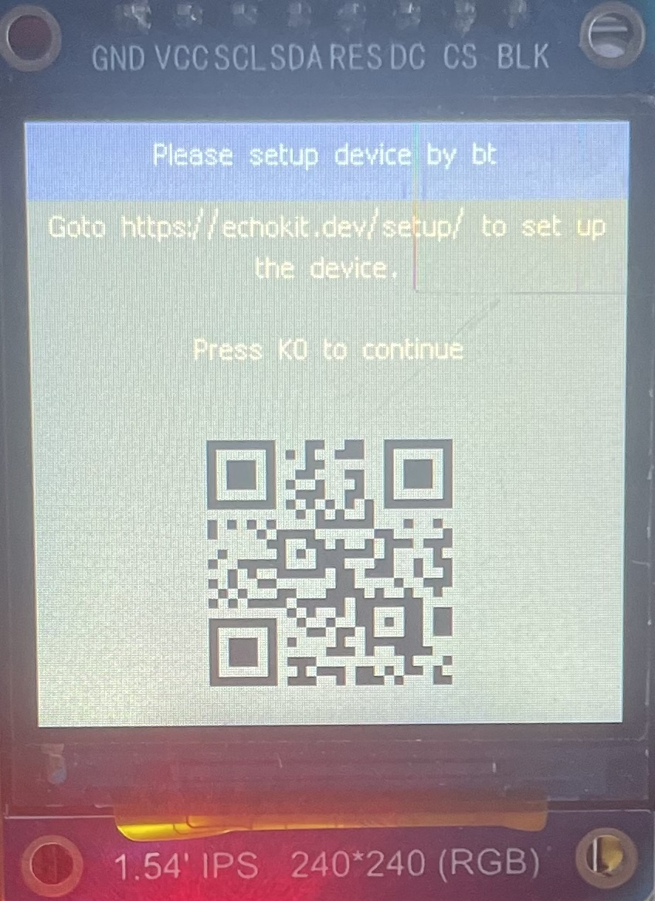
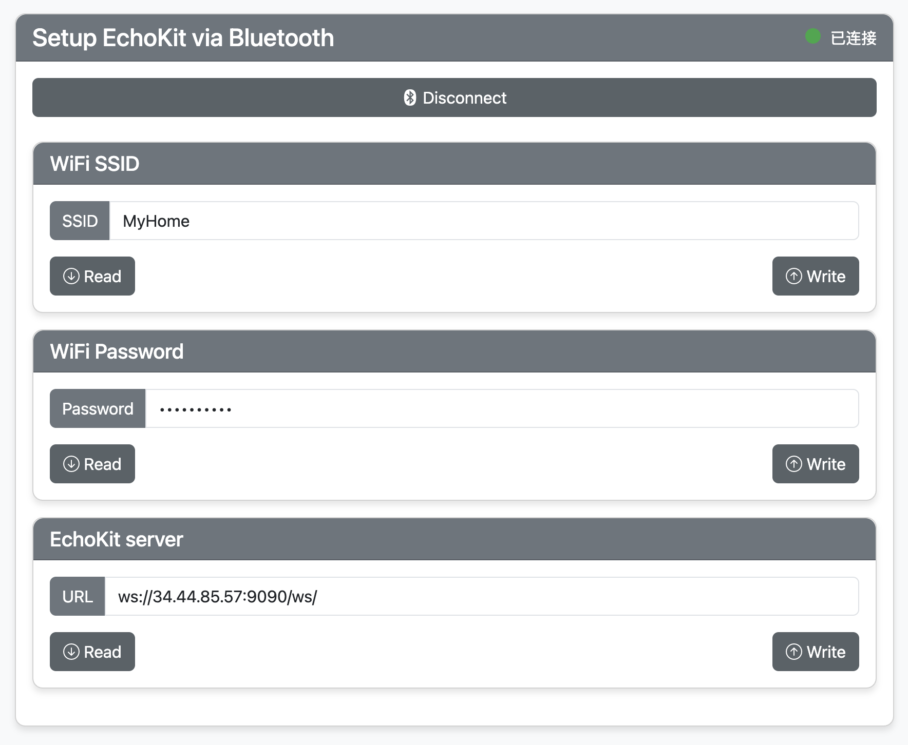

# Quick Start with EchoKit DIY

This guide walks you through setting up your **EchoKit**, which comes pre-assembled and ready to use.  

> If you would like to get a preview before your EchoKit device arrives, you can use our [web-base EchoKit device simulator](https://echokit.dev/chat/resources/).

## Get familiar with the buttons

Let’s take a moment to get familiar with the common buttons and ports. The image below gives you a clear overview of them. Learn more about the buttons on Button on [Buttons on EchoKit DIY](../hardware/buttons-echokit-diy.md)

## Step 1: Power up EchoKit

Use a **USB Type-C data cable** to connect EchoKit to a power source, such as a battery charger or your computer. The Type-C port is located on the **left side** of the device.

You will see the QR code display on the EchoKit screen. If not, click on the [**RST button**](../hardware/buttons-echokit-diy.md) to restart the device, and then immediately, press and hold the [**K0 button**](../hardware/buttons-echokit-diy.md).

## Step 2: Connect EchoKit to Your Computer

Open a web browser on a desktop computer and go to:  
👉 [**https://echokit.dev/setup/**](https://echokit.dev/setup/)

> Make sure that your computer has Bluetooth turned ON.

Click **Connect to EchoKit** to begin Bluetooth pairing.

## Step 3: Configure Wi-Fi and Server

Once paired via Bluetooth, you’ll be redirected to a setup interface where you can enter:

- **Wi-Fi Network**: Your Wi-Fi network name. It MUST be a 2.4G network.
- **Wi-Fi Password**: Your Wi-Fi access code  
- **EchoKit Server**: The IP and port of the EchoKit Server you're connecting to. You can use our hosted servers depending on your location:
    - 🇺🇸 US: `ws://indie.echokit.dev/ws`
    - 🇭🇰 EU: `ws://eu.echokit.dev/ws`
    - 🇹🇼 Taiwan and southeast Asia: `ws://tw.echokit.dev/ws`
    - 🇸🇬 Rest of the world: [run your own EchoKit server]../(server/quick-start.md)
- **Background Image**: Upload a transparent GIF image as the background for the device.

For each field, click the **"Write"** button after entering the value.

After you are done writing all fields, click [**K0 button**](../hardware/buttons-echokit-diy.md) on the EchoKit device.

## Step 4: Confirm Setup on EchoKit

Once configuration is complete, EchoKit will:

- Display a welcome screen  
- Play a voice greeting like: **"Hi there"**  
- Show a message like: **"Hello Set"**

This means your device is ready to use!

## Step 5: Start Chatting

Press the [**K0 button**](../hardware/buttons-echokit-diy.md) to start your conversation with EchoKit. The status bar at the top of the screen says "Listening ..." and it is ready to respond to you!

If it says "Idle" or "Speaking" in the status bar at the top of the screen, it cannot hear you and would not respond to you. ;) 

* When it's idle, press the K0 button to start chat mode.
* When it's speaking, press the K0 button to interrupt.
* When it's listening, press the K0 button to stop listening and go to the idle mode.

Enjoy your voice AI journey.

> If your EchoKit does not respond to you, please refer to the [troubleshooting guide](../troubleshooting.md).
