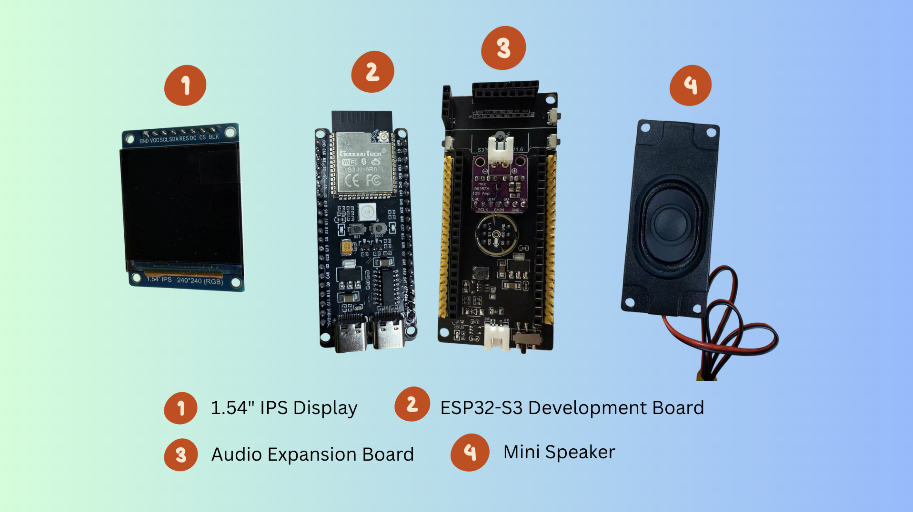
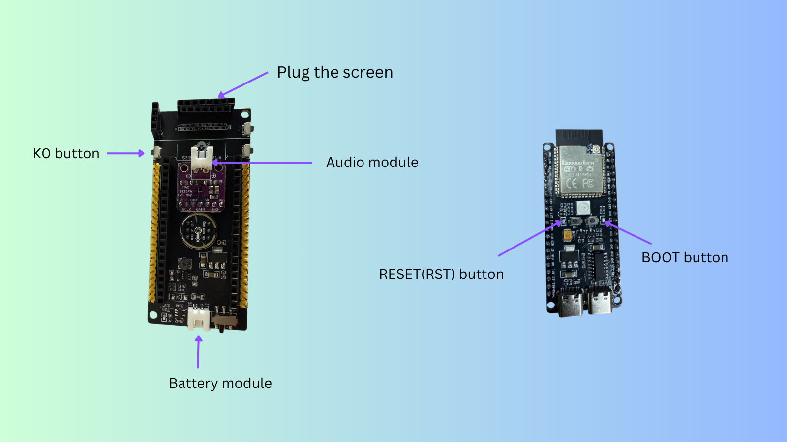

# Assemble EchoKit DIY

Before using your EchoKit, you’ll need to assemble its four components:

* **ESP32-S3 development board**
* **Extension board** (with audio and microphone module)
* **Mini speaker**
* **1.54" LCD screen**
  

## Steps to Assemble

1. **Connect the mini speaker**  
   Plug the mini speaker into the audio module located in the middle of the extension board.

2. **Attach the ESP32-S3 board**  
   Mount the ESP32-S3 development board onto the extension board.

3. **Insert the LCD screen**  
   Plug the 1.54" LCD screen into the slot at the top of the extension board.

✅ You’ve now assembled your EchoKit! 
 
Next, continue to **[Flash the Firmware](./flash-firmware.md)**.
