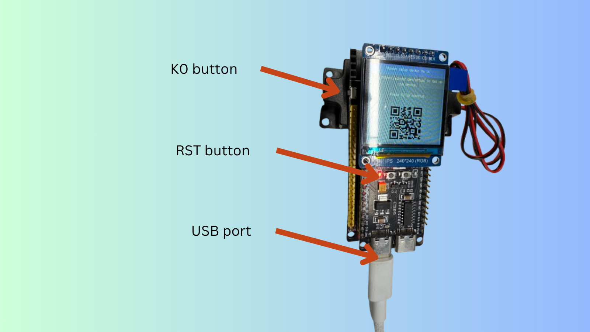
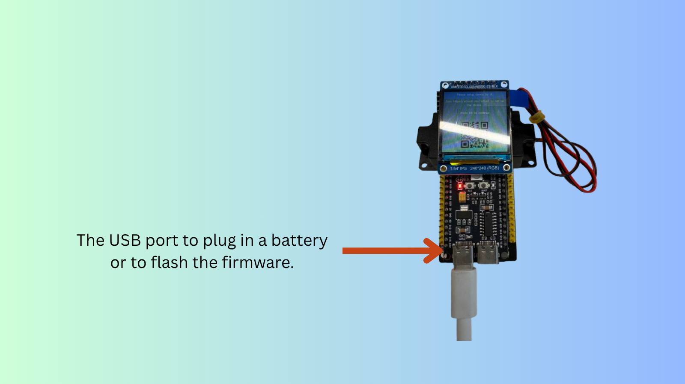
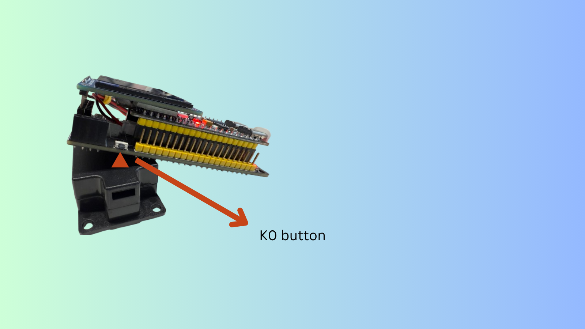
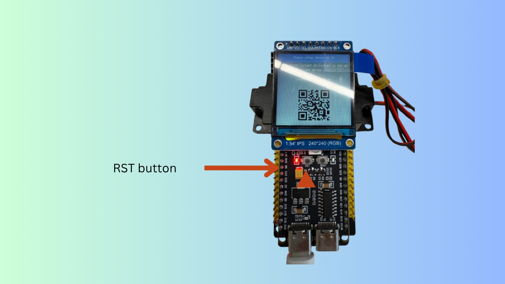

# Buttons on EchoKit DIY

After [assembling your EchoKit DIY device](./assemble-echokit.md), let’s take a moment to get familiar with the common buttons and ports before moving on to the next chapter. You can have a full view of them in the image below.

## USB Port — for Power and Firmware Flashing

There are two USB ports on the ESP32 development board.
The **right-side port** is the one you’ll typically use. You can use this USB port to:

* Power the device using a battery or USB cable
* Flash new firmware onto the board

## K0 Button

The **K0 button** (located on the left side of the device) is a multi-purpose control button. It’s used when you want to:

* Flash the firmware
* Connect or reconnect the EchoKit device to the server
* Start a conversation
* Interrupt or stop the conversation

You can have a full view by the following image.

## RST Button

The **RST button** (located on the left side of the ESP32 development board) is used to:

* Restart the device
* Reconnect the EchoKit device to the server

