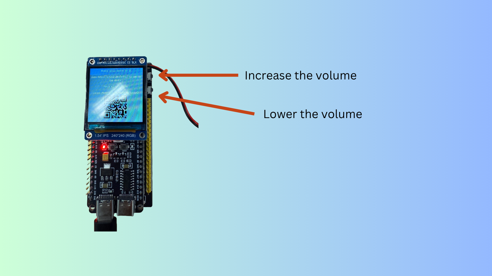

# Buttons on EchoKit DIY

After [assembling your EchoKit DIY device](./assemble-echokit.md), let’s take a moment to get familiar with the common buttons and ports before moving on to the next chapter. You can have a full view of them in the image below.

## K0 Button

The **K0 button** (located on the left side of the device) is a multi-purpose control button. It is used when you want to

* Toggle between listening and idle modes when the device is not speaking. 

* Interrupt the device and switch to listening mode, when the device is speaking.

You also need this button when you want to

* Configure WiFi and EchoKit server. [Learn more](../get-started/echokit-diy.md).
* Flash the device. [Learn more](flash-firmware.md).

## RST Button

The **RST button** (located on the left side of the ESP32 development board) is used to restart the device. As mentioned above, it could also be used with **K0** to configure or flash the device.

## USB Ports — Power and Firmware Flashing

There are two USB ports on the ESP32 development board.
The **right-side port** is the one you’ll typically use. You can use this USB port to

* Power the device using a USB cable.
* Flash new firmware onto the device. [Learn more](flash-firmware.md)

## Volume button -- Adjust the volume

The **volume buttons** (located on the left side of the device) are used to adjust the volume of the device.
* The top button increases the volume.
* The bottom button lowers the volume.

