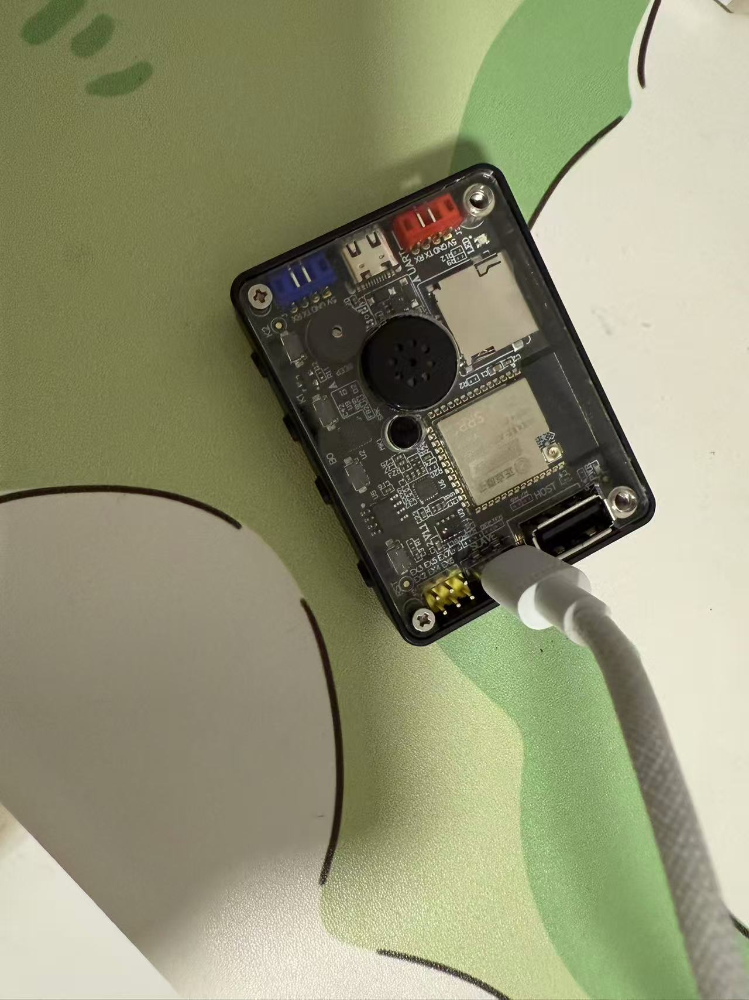
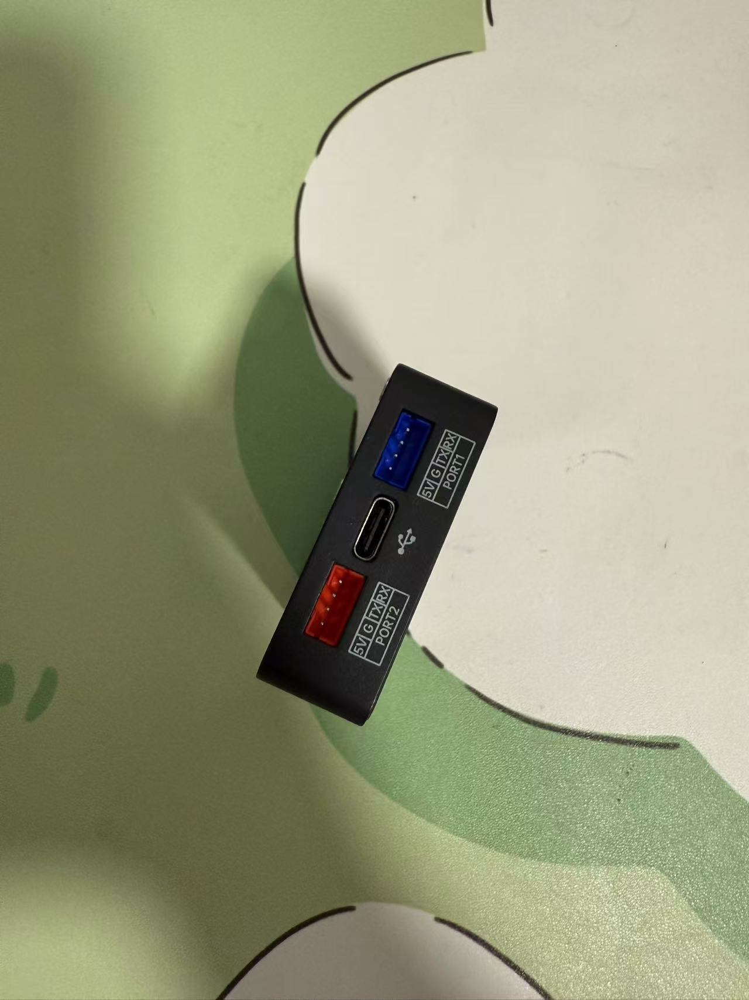

# Buttons on EchoKit Box

Before we move to the next chapter, let's take a quick look at the common buttons and ports on the EchoKit Box. The buttons are much clearer on this model compared to the EchoKit DIY.

## K0 Button

The **K0 button** (located on the upper base of the device) is a multi-purpose control button. It is used when you want to

* Toggle between listening and idle modes when the device is not speaking. 

* Interrupt the device and switch to listening mode, when the device is speaking.

You also need this button when you want to

* Configure WiFi and EchoKit server. [Learn more](../get-started/echokit-diy.md).
* Flash the device. [Learn more](flash-firmware.md).

## RST Button

The **RST button** (located on the upper base of the device) is used to restart the device. As mentioned above, it could also be used with **K0** to configure or flash the device.

## Volume button -- Adjust the volume

The **volume buttons** (located on the upper base of the device) are used to adjust the volume of the device.
* The K1 button increases the volume.
* The J1 button lowers the volume.

## USB Ports — Power and Firmware Flashing

The EchoKit Box includes two distinct USB ports.

The USB port located on the back face serves two functions: powering the device and [flashing the hardware](flash-hardware.md) (using either CLI commands or the ESP Launchpad).

The USB port on the left face is dedicated to providing power only.

