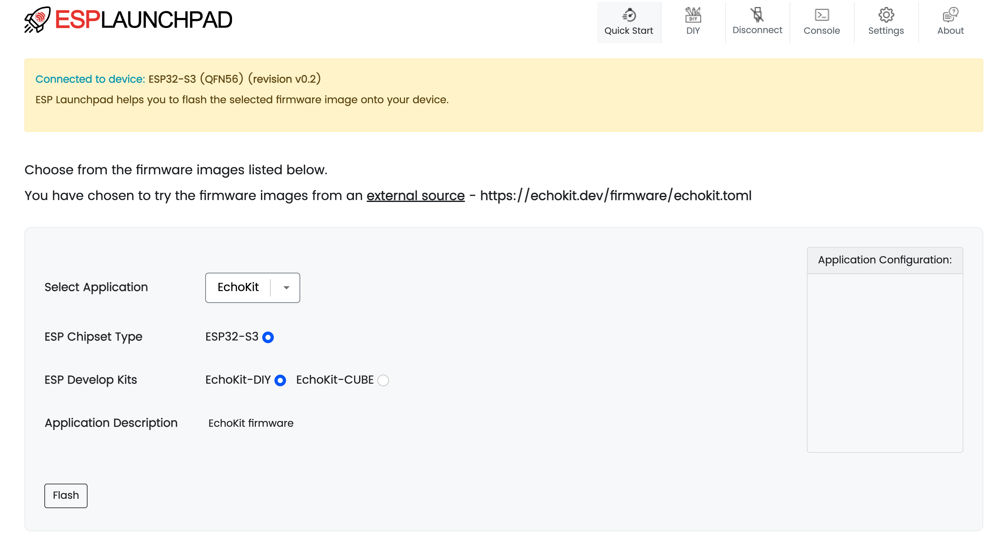

# Flash the firmware

Each EchoKit comes pre-flashed with our [open-source ESP32 firmware](https://github.com/second-state/echokit_box). If your device isn't working as expected, you can manually re-flash it by following these steps.

## 1. Connect your EchoKit device to your computer

You need to use an USB cable to connect between your computer and the USB-C port on EchoKit labeled `TTL`. Your computer will probably prompt you to accept or trust the connected USB device. You MUST accept the USB connection.


> On many devices, there are two USB ports, but only the `SLAVE` port can take commands from another computer. You must connect to that `SLAVE` USB port.

## 2. Use the ESP32 launchpad to flash

[Load the launchpad](https://espressif.github.io/esp-launchpad/?flashConfigURL=https://echokit.dev/firmware/echokit.toml) and follow instructions to "Connect" and the "Flash".



> If it fails, you may force the EchoKit device to enter the "flashing" mode by pressing down the small `RST` button on the main board (maybe behind the screen), and at the time, press and release the `K0` (or `BOOT`) button to the left side of the device.

**After completing this process, your EchoKit should display a QR code and instructions on its screen.**


## 3. Use a command line tool to flash

Alternatively, you could use the `espflash` command to flash the firmware. It is often faster and easier if you are a software developer!

## 3.1 Install the Rust Toolchain

First, make sure you have the Rust toolchain installed. If not, follow [the official Rust installation guide](https://www.rust-lang.org/tools/install).

## 3.2 Install `espflash` and Dependencies

Run the following command to install `espflash` and related tools:

```bash
cargo install cargo-espflash espflash ldproxy
```

## 3.3 Download the Precompiled Firmware

Fetch the latest precompiled EchoKit firmware:

```bash
curl -L -o echokit https://echokit.dev/firmware/echokit-boards
```

## 3.4 Flash the Firmware to EchoKit

Use the command below to flash your device:

```bash
espflash flash --monitor --flash-size 16mb echokit
```

You should see output similar to this:

```
[2025-04-28T16:51:43Z INFO ] Detected 2 serial ports
[2025-04-28T16:51:43Z INFO ] Ports which match a known common dev board are highlighted
[2025-04-28T16:51:43Z INFO ] Please select a port
✔ Remember this serial port for future use? · no
[2025-04-28T16:52:00Z INFO ] Serial port: '/dev/cu.usbmodem2101'
[2025-04-28T16:52:00Z INFO ] Connecting...
[2025-04-28T16:52:00Z INFO ] Using flash stub
Chip type:         esp32s3 (revision v0.2)
Crystal frequency: 40 MHz
Flash size:        8MB
Features:          WiFi, BLE
... ...
I (705) boot: Loaded app from partition at offset 0x10000
I (705) boot: Disabling RNG early entropy source...
I (716) cpu_start: Multicore app
```

Once flashing succeeds, you should see output similar to this:

```
I (4990) esp32_nimble::ble_device: Device Address: 98:A3:16:E5:D8:4A
I (4993) NimBLE: GAP procedure initiated: advertise; 
I (4996) NimBLE: disc_mode=2
I (4998) NimBLE:  adv_channel_map=0 own_addr_type=0 adv_filter_policy=0 adv_itvl_min=0 adv_itvl_max=0
I (5007) NimBLE: 

I (5010) echokit: Free SPIRAM heap size: 5248788
I (5014) echokit: Free INTERNAL heap size: 81847
I (5147) esp_idf_hal::interrupt::asynch: IsrReactor "IsrReactor" started.
```
And the display will light and show the QR code.

## Next steps

After flashing, you’ll need to:

1. [Set up and run an EchoKit server](../server/echokit-server.md)
2. [Configure your device](../server/setup.md) to connect to the server

Once both steps are complete, your EchoKit will be ready for use.


