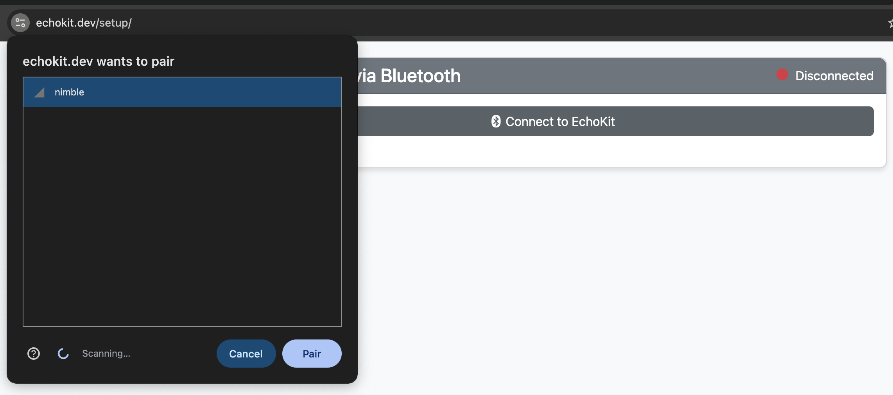
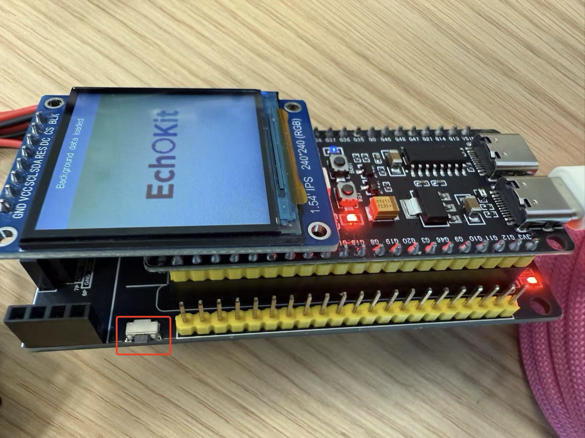

# Quick Start with EchoKit

This guide walks you through setting up your **EchoKit**, which comes pre-assembled and ready to use.  
If you are using **EchoKit DIY Edition**, please refer to the flashing guide before continuing.

If you would like to get a preview before your EchoKit device arrives, you can use our [web-base EchoKit device simulator](https://echokit.dev/chat/resources/).

---

## Step 1: Connect EchoKit to Your Computer

Use a **USB Type-C data cable** to connect EchoKit to your computer.  
The Type-C port is located on the **left side** of the device.

Next, open your browser and go to:  
👉 [https://echokit.dev/setup/](https://echokit.dev/setup/)

Click **“Connect to EchoKit”** to begin Bluetooth pairing.

---

## Step 2: Configure Wi-Fi and Server

Once paired via Bluetooth, you’ll be redirected to a setup interface where you can enter:

- **Wi-Fi SSID**: Your Wi-Fi network name  
- **Wi-Fi Password**: Your Wi-Fi access code  
- **EchoKit Server**: The IP and port of the EchoKit Server you're connecting to. You can use our hosted servers depending on your location:
    - 🇺🇸 US: `ws://indie.echokit.dev/ws`
    - 🇭🇰 Hong Kong: `ws://hk.echokit.dev/ws`
    - 🇸🇬 Singapore: TBD

For each field, click the **"Write"** button after entering the value.

---

## Step 3: Confirm Setup on EchoKit

Once configuration is complete, EchoKit will:

- Display a welcome screen  
- Play a voice greeting like: **"Hi there"**  
- Show a message like: **"Background data loaded"**

This means your device is ready to use!

---

## Step 4: Start Chatting

Press the **K0 button** (on the left-hand side of the device) to start your conversation with EchoKit.

Enjoy your voice AI journey.
