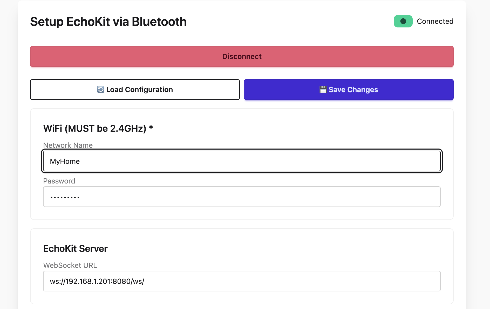
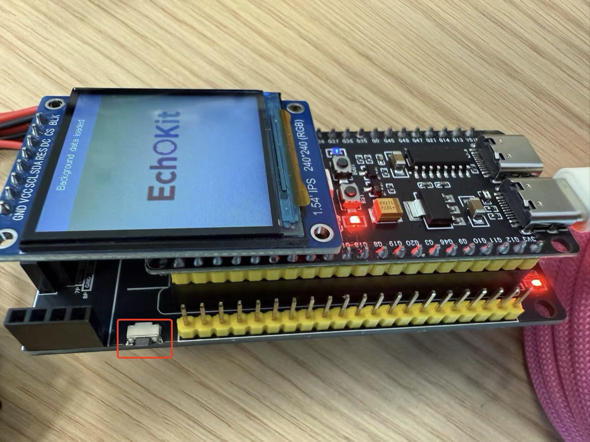

# Connect EchoKit Server with the Device

In this guide, we'll walk through connecting your EchoKit device to the EchoKit server.

## Prerequisites

Before starting, make sure you have:  

* A [running EchoKit server](../get-started/echokit-server.md)
* Powered up your EchoKit

**IMPORTANT** If you are connecting to an EchoKit server on your local network (e.g., a personal laptop connected to WiFi), you will need to find out the local network IP address of the computer. You can typically find that information by opening network settings on that computer. The IP address is something like `192.168.2.101`.

## Steps to Connect

1. Open [https://echokit.dev/setup/](https://echokit.dev/setup/) in your browser.  
2. Click **Connect to EchoKit**.  
3. Find the device named **`nimble`** or `echokit` and click **Pair**.  
4. Enter the following details:  
   * **Wi-Fi name (SSID)**  EchoKit supports 2.4 GHz WiFi only.
   * **Wi-Fi password**  
   * **EchoKit server URL** E.g., public server: `ws://echokit-server.fly.dev/ws`, or personal server on the local network: `ws://192.168.2.101:8080/ws`

 

5. Click the **Save Changes** button to apply the new settings. Meanwhile, you will see the EchoKit device will restrart automatically.

## Expected Outcome

Once the connection is successful: 

* The device will greet you with an audio message: **“Hi there”**   

Your EchoKit is now connected and ready to use.

## Next

Press the **K0 button** to start your conversation with EchoKit.

## Use a different Echokit server

If you want to use a different EchoKit server, you will need to enter the device setup page again.

1. Press the **RST** (reset) button to restart the device.
2. Immediately press and hold the **K0** button until the QR code appears.
3. Repeat the steps above to pair the device and re-enter your Wi-Fi and server details.
