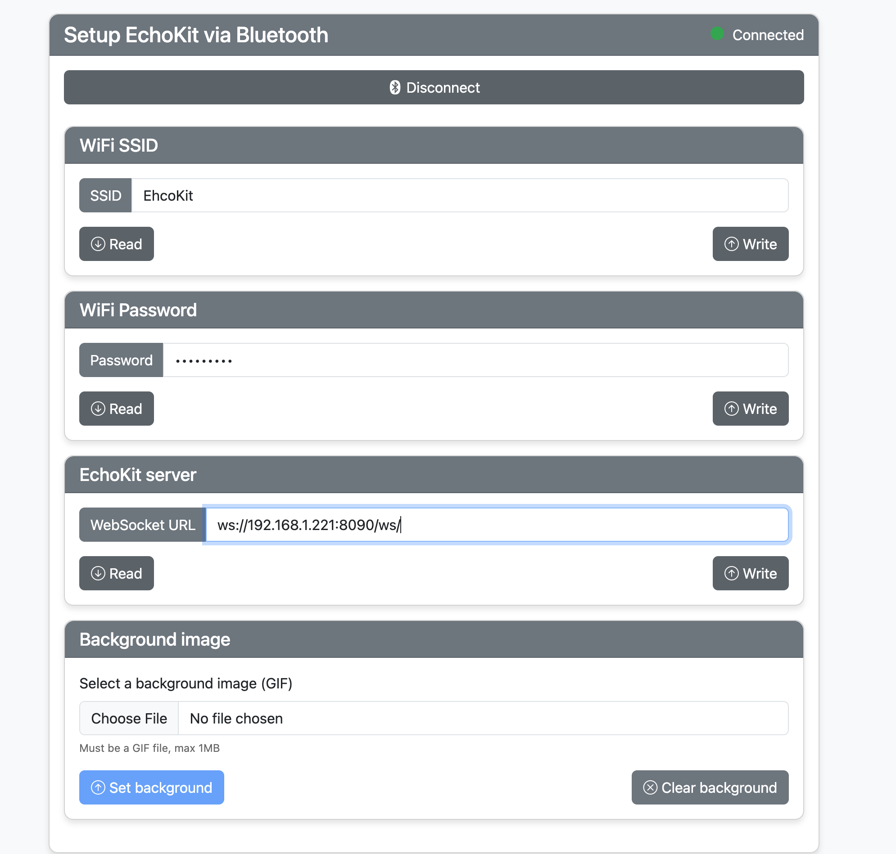

# Connect EchoKit Server with the Device

In this guide, we’ll walk through connecting your EchoKit device to the EchoKit server.

## Prerequisites

Before starting, make sure you have:  
* Successfully **flashed the EchoKit hardware**  
* A **running EchoKit server**  

## Steps to Connect

1. Open [https://echokit.dev/setup/](https://echokit.dev/setup/) in your browser.  
2. Click **Connect to EchoKit**.  
3. Find the device named **`nimble`** and click **Pair**.  
4. Enter the following details:  
   * **Wi-Fi name (SSID)**  
   * **Wi-Fi password**  
   * **EchoKit server URL**  

   👉 Remember to click **Write** to save the settings.  

   

5. Press the **RST (reset) button** on the device to apply the new settings.  

## Expected Outcome

Once the connection is successful:  
* The device will greet you with an audio message: **“Hi there”**  
* The display will show the background image  

Your EchoKit is now connected and ready to use.

## Re-connect the Echokit server

If you need to update your Wi-Fi settings, you’ll have to reconnect the EchoKit device to the server.

1. Press the **RST (reset) button** on the device.  
2. When you see Reconnect the WiFi on the screen, press and hold the **BOOT button** until the QR code appears again.  
3. Repeat the above steps to pair the device and re-enter your Wi-Fi and server details.  
