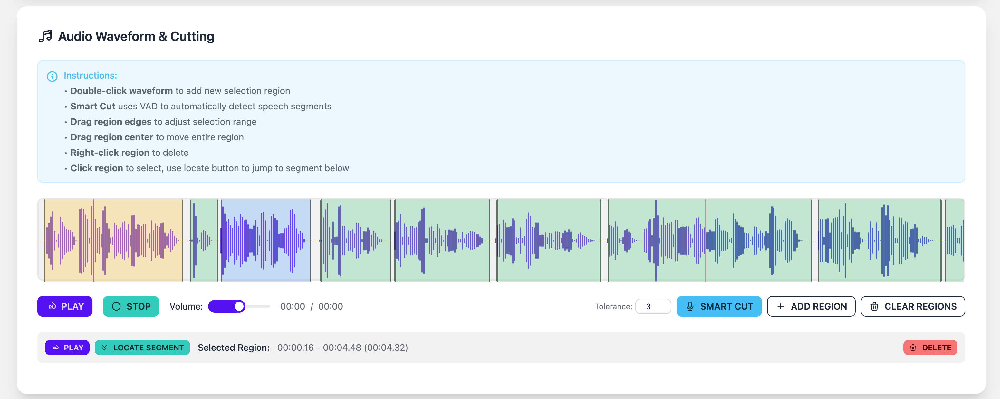
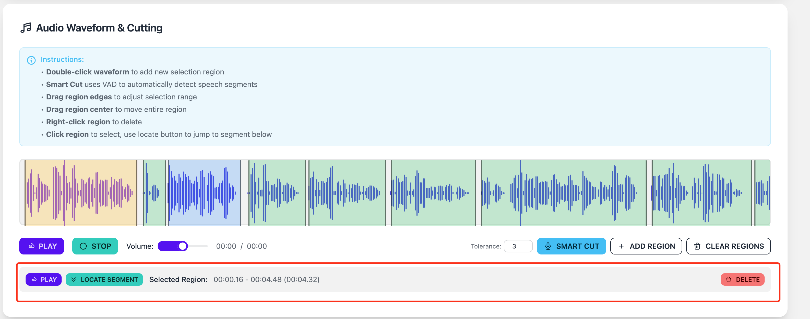

# Segment Audio Files with EchoKit's Audio Processor

Voice cloning requires high-quality audio segments to achieve the best results. This guide will walk you through using EchoKit's audio processor to properly segment your audio files for voice cloning.

By the end of this step, you will have:
* A folder consluding Multiple audio segments, each 3 to 10 seconds long, totaling over 1 minute of speech
* A `.list` file concluding all transcriptions corresponding to each segmented audio file

## Prerequisites

Before you begin, ensure you have:

* A clear audio file (approximately 2-3 minutes long)
* No background music or noise in the recording
* Audio containing complete sentences
* (Optional) When recording yourself, pause briefly between sentences to simplify segmentation

## Step 1: Access the Audio Processor

1. Open your web browser and navigate to: https://echokit.dev/voice_clone/cut_en.html
2. You'll initially see the Whisper setup and file upload section for automatic speech recognition

## Step 2: Set Up Whisper

1. Configure Whisper for automatic speech recognition (this helps identify text from your audio)
2. Complete the Whisper setup as required

## Step 3: Upload Your Audio File

1. Click the CHOOSE FILE button
2. Select and upload your audio file
3. Wait for the upload to complete
4. You'll see the Audio Information and Audio Waveform & Cutting section displaying your file details (filename, duration, and size)

## Step 4: Segment Your Audio

Navigate to the Audio Waveform and Cutting section. Here you'll cut your audio following these guidelines:

**Segmentation Rules**

* Each segment must contain a complete sentence
* Each segment should be about 3 to 10 seconds long
* Segments should have clear start and end points

**Cutting process**

Click on Smart cut to get a draft version of the cutting using VAD.

Next you will need to listen to each segment carefully to ensure it follows the segmentation rules.

Click a segment and the Edit banner will show up.

Click on PLAY to hear the audio. If needed, drag the edges of the segment to adjust the start/end points.

Click on LOCATE SEGMENT to find the current segmentation in the Cut Results Management section.

Click on DELETE to delete the current segments.

Tips here:

1. Adjust the tolerance number to fine-tune VAD segmentation results.
2. Transcribe each segment to verify it contains a complete sentence.

## Finalize and Download
After completing all edits:

* Click DOWNLOAD ALL to save all segmented audio files.
* Click TRANSCRIBE ALL then COPY ALL to get transcriptions for all segments.
* Save the transcription as a .list file for future use.

