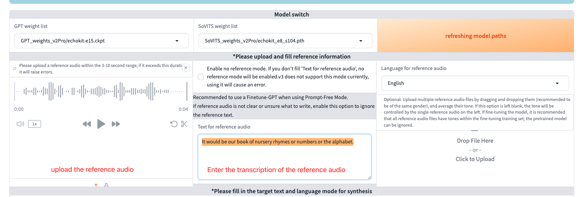

# Train Your Voice Model

Once you've prepared your high-quality audio segments, you're ready to train your custom voice model.

**What you'll get from this step:**
- `t2s.pt` - Text-to-speech model file
- `vits.pt` - Voice synthesis model file

## What You'll Need

We'll use **Google Colab** for training since it's free and provides the GPU power you need.

Make sure you have:
1. A Google Drive account
2. A Google Colab account

## Step 1: Set Up Model Files

First, you'll need access to the pre-trained model files.

1. **Add model files to your Drive**: Visit the [GPT-SoVITS Google Drive Folder](https://drive.google.com/drive/folders/1SY-ncxlcXn9uz3932VhTA13mBF6mzfyS?usp=sharing)
2. **Create a shortcut**: Click "Add shortcut to Drive" to add these files to your workspace (see image below)


## Step 2: Open the Training Notebook

1. **Open the template**: Go to the [Training Notebook](https://colab.research.google.com/drive/1eWxvPrpOay3bUgQX0_L2AfODC73MeMNi?usp=sharing)
2. **Make your own copy**: Go to **File → Save a copy in Drive**
3. **Connect your Drive**: Click the Drive folder icon to mount Google Drive

4. **Grant permissions**: Allow Colab to access your Drive files

Click the folder icon on the left sidebar to browse your Drive contents.

## Step 3: Upload Your Audio Data

Now you'll upload the audio segments you prepared in the last article.

1. **Create a list file**: Make a `.list` file containing your transcriptions from the website
2. **Organize your files**: Put the `.list` file in the same folder as your audio files  
3. **Compress the folder**: Create a zip file of your entire audio folder
4. **Upload to Colab**: Use the upload icon in Colab's file browser
5. **Extract the files**: Run `unzip your-folder.zip` in a code cell

## Step 4: Copy Model Files to Your Workspace

The shortcut you created points to the model files, but you need actual copies in your workspace.

1. **Open terminal**: Click the terminal icon (bottom-left in Colab)
2. **Run these commands**:
   ```bash
   cd drive/MyDrive
   mkdir -p workspace/GPT-SoVITS/
   cp -r GPT-SoVITS/* workspace/GPT-SoVITS/
   ```

*Note: This will take a few minutes since the files are several GB in size.*

## Step 5: Install Dependencies

Run each cell in your notebook in order, ending with:

```bash
!pip install -r requirements.txt
```

**Important**: When this finishes, you'll be asked to restart the runtime. Click "Restart".

## Step 6: Prepare Your Training Data

After restarting, run the cells starting from:

```python
%cd /content/drive/MyDrive/workspace/GPT-SoVITS
```

Continue until you reach this code block:

```python
import os

def process_ad_list(file_path, speaker_name, language):
    """
    Processes your audio list file and formats it for training.
    
    Args:
        file_path: Path to your .list file
        speaker_name: Name for your voice model  
        language: Language code (e.g., 'en' for English)
    """
    directory = os.path.dirname(file_path)
    formatted_lines = []
    
    with open(file_path, 'r') as f:
        for line in f:
            line = line.strip()
            if line:
                parts = line.split('|', 1)
                if len(parts) == 2:
                    path, text = parts
                    full_path = os.path.join(directory, path)
                    formatted_line = f"{full_path}|{speaker_name}|{language}|{text}"
                    print(formatted_line)
                    formatted_lines.append(formatted_line)
                else:
                    print(f"Skipping invalid line: {line}")
    
    return '\n'.join(formatted_lines)
```

**Before running the next command**, update these values to match your setup:
- File path: `/content/train-model/echokit.list` → your actual .list file path
- Model name: `echokit` → your preferred model name
- Language: `en` → your language code

```python
s = process_ad_list('/content/train-model/echokit.list', 'echokit', 'en')
with open('/content/train-model/echokit.new.list', 'w') as f:
    f.write(s)
```

## Step 7: Start the Training Interface

Run this command to launch the web interface:

```bash
!export is_share=True && python webui.py
```

You should see output like:
```
Running on local URL:  http://0.0.0.0:9874
Running on public URL: https://fbefe7d567a1054c43.gradio.live
```

**Open the public URL** in your browser and click the **1-GPT-SOVITS-TTS** tab.

## Step 8: Configure Training Settings

1. **Enter your model details**:
   - Model name: Use the same name from Step 6
   - List file path: Path to your `.list` file from Step 6


2. **Run preprocessing steps** (click each button and wait for completion):
   - "Open Tokenization & BERT Feature Extraction"
   - "Open Speech SSL Feature Extraction" 
   - "Open Semantics Token Extraction"


## Step 9: Train Your Models

1. **Go to the 1B-Fine-Tuning tab**
2. **Start training** (click each button and wait):
   - "Open SoVITS Training"
   - "Open GPT Training"


## Step 10: Test Your Model

1. **Go to the 1C-Inference tab**
2. **Select your trained models**:
   - GPT weight: Choose `GPT_weights_v2Pro/[model-name]-e15.ckpt`
   - SoVITS weight: Choose `SoVITS_weights_v2Pro/[model-name]_e8_s104.pth`
3. **Click "Open TTS Inference WebUI"**

Check your Colab notebook for the inference URL:


## Step 11: Test Voice Generation

Open the inference URL in your browser:

1. **Upload reference audio**: Use one of your training audio files
2. **Enter reference text**: Type the exact transcription of your reference audio
3. **Test generation**: 
   - Enter text you want to synthesize
   - Select the correct language
   - Click "Start inference"




If you're not satisfied with the results, review your training audio quality and consider retraining.

## Step 12: Export Your Models

Once you're happy with the voice quality:

1. **Prepare reference audio**: Convert your reference audio to 16kHz:

   ```bash
   ffmpeg -i REFERENCE_AUDIO_PATH.wav -ar 16000 -ac 1 output.wav
   ```

2. **Export the models**: Run this command (update the paths to match your setup):
   ```bash
   !python GPT_SoVITS/stream_v2pro.py \
   --gpt_model GPT_weights_v2Pro/echokit-e15.ckpt \
   --sovits_model SoVITS_weights_v2Pro/echokit_e8_s104.pth \
   --ref_audio /content/output.wav \
   --ref_text 'It would be our book of nursery rhymes or numbers or the alphabet.' \
   --output_path /content/models \
   --version v2Pro \
   --device=cuda
   ```

**Make sure to update**:
- `gpt_model`: Path to your GPT model
- `sovits_model`: Path to your SoVITS model  
- `ref_audio`: Path to your 16kHz reference audio
- `ref_text`: Exact transcription of your reference audio
- `output_path`: Where to save the final model files

## Final Output

After export completes, you'll have:
- `out_final.wav` - Test audio to verify everything works
- `t2s.pt` - Your text-to-speech model
- `vits.pt` - Your voice synthesis model

Listen to `out_final.wav` to confirm your model is working properly.

**Next step**: Deploy your models to start using your custom voice!